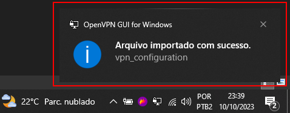

# Hello Ambiente

## Sobre

* VPN
* Hosts
* Visual Studio Lib's

## Clonando este repositório
* Copie o endereço deste repositório clicando no botão verde "CODE", escolha entre https ou ssh, e copie o link da caixinha abaixo.

    

* Navegue até a Raiz do seu disco local C ("C:/"), e pressione o botão SHIFT do seu teclado e ao mesmo tempo clique com o botão direto do mouse em um espaço vazio da janelinha.

* Irá abrir um menu do windows, neste menu clique em "Abrir janela do PowerShell aqui" ( se for cmd, da no mesmo. )

* Na tela do powershell, confirme que está no diretorio correto, caso esteja digite o comando "git clone" seguido da url que você copiou nos passos anteriores.

    

* Pressione enter pra rodar o comando, que clonará o repositório para o seu Disco Local C.

    > [!WARNING]  
    > O repositório deve estar clonado obrigatoriamente na raiz do Disco Local C, caso não esteja, todas as referências a partir daqui não funcionarão!

## Instalação e Configuração do OpenVPN
* Navegue até a pasta "C:\env_cre_windows\open-vpn-gui" e abra o arquivo "OpenVPN-2.5.8.msi".

    

* Faça a instalação do OpenVPN normalmente (next, next, next ... não tem segredo.)
* Após instalado clique ou pressione a bandeirinha do windows no seu teclado e digite "OpenVPN", e abra a aplicação.

    

* Ao abrir a aplicação você receberá uma notificação informando que não foram localizados arquivos de configuração, isso é normal, aqui é só clicar em "OK".

    

* Após clicar em "OK" na tela anterior, o programa será aberto, porem ficará somente com um icone próximo ao relógio do windows.

* Clique com o botão direito do mouse no icone da VPN próximo ao relógio do windows navegue por "Import" e clique em "Importar arquivo".

    

* Ao Clicar em "Importar arquivo" uma nova tela vai abrir pendindo pra localizar o arquivo de configuração (.ovpn), localize o arquivo, selecione e clique em "Abrir".

    

* Uma notificação de confirmação vai aparecer no canto inferior direito da sua tela, informando que o arquivo foi importado com sucesso.

    

* Clique com o botão direito do mouse no icone da VPN próximo ao relógio do windows e clique em "Conectar".

    

* Após clicar em "Conectar" uma nova tela do OpenVPN será aberta, nessa tela insira o seu usuário e senha fornecidos pela CBYK, marque a caixinha "Salvar senha" e clique em "OK".

    

* Após clicar em "OK" a VPN tentará estabelecer uma conexão com o servidor, e, após conectar com sucesso, você receberá uma notificação no canto inferior direito da sua tela informando e o icone da VPN ficará verde.

    

## Configuração do Hosts
* Navegue ate a pasta "C:\Windows\System32\drivers\etc".
* Nessa pasta selecione o arquivo "hosts" e abra com seu editor preferido em modo administrador.

    

* Copie o conteudo abaixo e cole no final do seu arquivos hosts deixando uma ou duas linhas de espaço.

        # ADICIONADOS MANUALMENTE
        10.0.162.162    jenkins.local
        10.0.158.201    atf.local
        10.0.162.218    gitlab.local
        10.0.127.54     git.adobenet.com.br
        10.0.158.126    npm-corp.local
        10.0.126.163    webmail.local

* O seu arquivo hosts deverá ficar desse jeito:

    

* Salve o arquivo, feche e abra novamente no editor para assegurar que o conteúdo foi, de fato, escrito no arquivo.