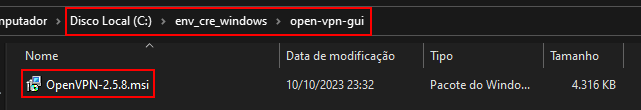

> [!WARNING]  
> **ESTE REPOSITÓRIO DEVE ESTAR CLONADO OBRIGATORIAMENTE NA RAIZ DO DISCO LOCAL C, CASO NÃO ESTEJA, TODAS AS REFERÊNCIAS A PARTIR DAQUI NÃO FUNCIONARÃO!**

## Clonando este repositório
* Copie o endereço deste repositório clicando no botão verde "CODE", escolha entre https ou ssh, e copie o link da caixinha abaixo.

    

* Navegue até a Raiz do seu disco local C ("C:/"), e pressione o botão SHIFT do seu teclado e ao mesmo tempo clique com o botão direto do mouse em um espaço vazio da janelinha, isso abrirá um menu do windows, neste menu clique em "Abrir janela do PowerShell aqui" ( se for cmd, da no mesmo. ).

    

* Na tela do powershell, confirme que está no diretorio correto, caso esteja digite o comando "git clone" seguido da url que você copiou nos passos anteriores.

    

* Pressione enter pra rodar o comando, que clonará o repositório para o seu Disco Local C.

    > [!WARNING]  
    > **O repositório deve estar clonado obrigatoriamente na raiz do Disco Local C, caso não esteja, todas as referências a partir daqui não funcionarão!**

  
## Instalação e Configuração do OpenVPN
* Navegue até a pasta "C:\env_cre_windows\open-vpn-gui" e abra o arquivo "OpenVPN-2.5.8.msi".

    

* Faça a instalação do OpenVPN normalmente (next, next, next ... não tem segredo.)
* Após instalado clique ou pressione a bandeirinha do windows no seu teclado e digite "OpenVPN", e abra a aplicação.

    

* Ao abrir a aplicação você receberá uma notificação informando que não foram localizados arquivos de configuração, isso é normal, aqui é só clicar em "OK".

    

* Após clicar em "OK" na tela anterior, o programa será aberto, porem ficará somente com um icone próximo ao relógio do windows.

* Clique com o botão direito do mouse no icone da VPN próximo ao relógio do windows, navegue por "Import" e clique em "Importar arquivo".

    

* Ao Clicar em "Importar arquivo" uma nova tela vai abrir pendindo pra localizar o arquivo de configuração (.ovpn), localize o arquivo, selecione e clique em "Abrir".

    

* Uma notificação de confirmação vai aparecer no canto inferior direito da sua tela, informando que o arquivo foi importado com sucesso.

    

* Clique com o botão direito do mouse no icone da VPN próximo ao relógio do windows e clique em "Conectar".

    

* Após clicar em "Conectar" uma nova tela do OpenVPN será aberta, nessa tela insira o seu usuário e senha fornecidos pela CBYK, marque a caixinha "Salvar senha" e clique em "OK".

    

* Após clicar em "OK" a VPN tentará estabelecer uma conexão com o servidor, e, após conectar com sucesso, você receberá uma notificação no canto inferior direito da sua tela informando e o icone da VPN ficará verde.

    

  
## Configuração do Hosts

> [!NOTE]  
> **A adição dos dominios no arquivo hosts se faz necessaria, porque nao temos acesso aos DNS's do cliente pela VPN da CBYK, logo, para que o dominio seja resolvido para um ip, precisamos adicioná-lo ao arquivo hosts local.**

* Navegue ate a pasta "C:\Windows\System32\drivers\etc".
* Nessa pasta selecione o arquivo "hosts" e abra com seu editor preferido em modo administrador.

    

* Copie o conteudo abaixo e cole no final do seu arquivos hosts deixando uma ou duas linhas de espaço.

        # ADICIONADOS MANUALMENTE
        10.0.162.162    jenkins.local
        10.0.158.201    atf.local
        10.0.162.218    gitlab.local
        10.0.127.54     git.adobenet.com.br
        10.0.158.126    npm-corp.local
        10.0.126.163    webmail.local

* O seu arquivo hosts deverá ficar desse jeito:

    

* Salve o arquivo, feche e abra novamente no editor para assegurar que o conteúdo foi, de fato, escrito no arquivo.

    > [!IMPORTANT]  
    > **FAÇA OS TESTES, abrindo seu navegador e tentando acessar cada serviço da lista acima digitando o endereço no sua barra de navegação do browser, todos os serviços mostram uma pagina web e são acessiveis por https ("https://URL_DO_SERVIÇO/"), caso algum desses não abra no seu navegador, contate o seu gestor da CBYK para pedir os acessos que faltam.**

  
## Configuração do Repositorio de Libs no VS

* Navegue até a pasta "C:\env_cre_windows\nginx-bypass-nuget-ssl-error".

* Nesta pasta de um duplo clique em "nginx.exe", para iniciarmos nosso proxy reverso.
    > [!NOTE]  
    > **O proxy reverso é necessário porque não temos acesso á organização do cliente, invalidando todos os certificados dos serviços deles, sendo assim, não conseguimos apontar diretamente para o repositorio, e, logo precisamos de um proxy reverso que trata a conxão e faz um downgrade de https pra http, mitigando o erro.**

    > [!NOTE]  
    > **Caso queira parar o servidor, você pode encerra-lo pelo Gerenciador de Tarefas do windows.**

* Caso apareça um popup do firewall do windows, marque as duas caixinhas e clique em "Permitir acesso".

    

* Abra seu Visual Studio 2022 e navegue por "Ferramentas" > "Gerenciador de Pacotes do NuGet" > "Gerenciar Pacotes do NuGet para a Solução ..." e de um clique para abrir o menu de configurações do NuGet.

    

* No menu de configuração do NuGet, clique no icone da engrenagem.

    

* Nesta janela que se abriu, clique no "+" em verde, e uma nova conexão será criada, acesse essa nova conexão e cole os dados a seguir nos seus respectivos campos, depois clique em "Atualizar", e depois em "OK"

        Nome: ClienteATF
        Origem: http://localhost:9595/artifactory/api/nuget/v3/nuget-virtual

    

    > [!IMPORTANT]  
    > **As libs somente irão aparecer caso o servidor do proxy reverso esteja aberto e funcionando, você pode testar se o servidor está aberto e funcionando navegando até "http://localhost:9595/artifactory/api/nuget/v3/nuget-virtual" no seu browser e após esperar a pagina carregar, deve abrir um json com o nome de varias libs.**

    > [!NOTE]  
    > **Em proximas versões do Visual Studio, o protocolo http para pacotes do NuGet irá deixar de funcionar, e quando acontecer, subirei uma versão com um certificado auto assinado, mas por hora não se faz necessário, uma vez que a solução funciona.**

* Após isso ( com o servidor do proxy reverso funcionando ), clique na setinha ao lado da engrenagem, e selecione o repositorio "ClienteATF", e você deverá conseguir visualizar as libs no repositorio do cliente.

    

  
## ERROS COMUNS E SOLUÇÕES :
  
  ### GIT - Unable to Get Local Issuer Certificate:
  
   > [!NOTE]  
   > **Este erro é causado por que por padrão o protocolo GIT só aceita conexões https com certificado valido.**

   * Para resolver digite o comando abaixo no powershell ou cmd e, após isso, deverá funcionar corretamente.

         git config --global http.sslVerify false

  
  ### GIT - Unsafe Legacy Renegotiation Disabled:
  
   > [!NOTE]  
   > **Este erro é causado por incompatibilidade do certificado da vpn com a lib OpenSSL nativa do windows, mas pode ser facilmente mitigada com o tutorial abaixo.**

   * Pressione ou clique na bandeirinha do windows, digite "variáveis" no campo de pesquisa e clique atalho que será exibido.  
   

   * Uma tela de Propriedades do sistema vai abrir, nela clique no botão "Variáveis de Ambiente".  
   

   * Após abrir a tela de Variáveis de Ambiente, na parte inferior (Variáveis do Sistema), clique em novo.  
   

   * Preencha os campos com seus respectivos dados, depois clique em "OK", depois em "OK" novamente, e por fim no "X" pra fechar.

         Nome da variável: OPENSSL_CONF
         Valor da variável: C:\env_cre_windows\openssl-bypass-legacy-renegotiation\openssl.cnf
    
      
        